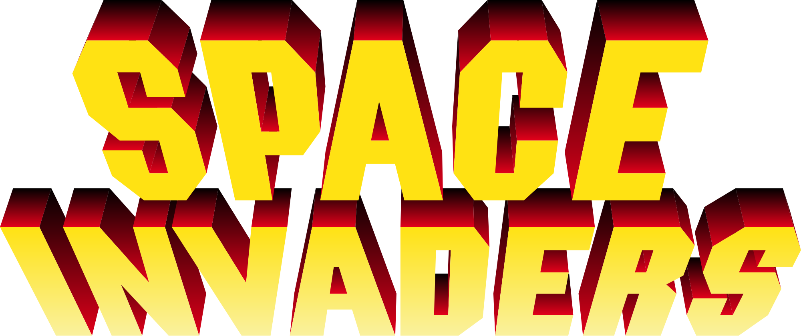

###### Arno Troch (arno.troch@student.uantwerpen.be)

## Introduction
This is (as you might have noticed already) a game based on Space Invaders. The game supports basic entities
like invaders, bullets, and shields and has multiple levels.

The player controls the player ship at the bottom of the screen, which can not only move horizontally, but can also 
shoot bullets at incoming invaders. The player has to try and kill all invaders before they reach the ground, and this 
without dying. The ship has 3 lives, so it can get hit twice before eventually dying, and it can also hide behind 
shields. When all invaders are killed, the current level is won and the player moves on to the next level. The goal is 
to try and finish all levels.

For more details about the actual implementation of the game, have a look at the [report](report.pdf).

## Controls
- **Start game/next level** space bar
- **Move left** left arrow key
- **Move right** right arrow key
- **Shoot** space bar

## Compiling/running
The `run.sh` script builds, installs and runs the game using cmake, so make sure cmake is installed (version 3.2 or 
higher). To run the script, execute the following commands in the root directory of this project:
    
    chmod +x run.sh
    ./run.sh

## Documentation
There is a `Doxyfile` which can generate the documentation for this project by executing the following command in the 
root directory of this project:

    doxygen Doxyfile
    
This will generate a directory called `html`, which includes an `index.html` file. Open this file in a browser to get to 
the main page of the documentation.
